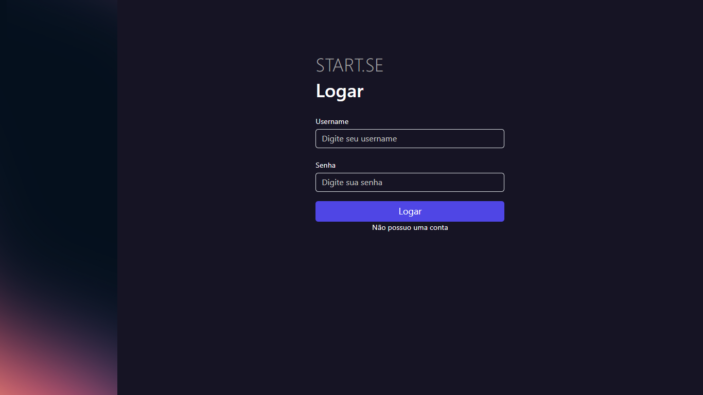
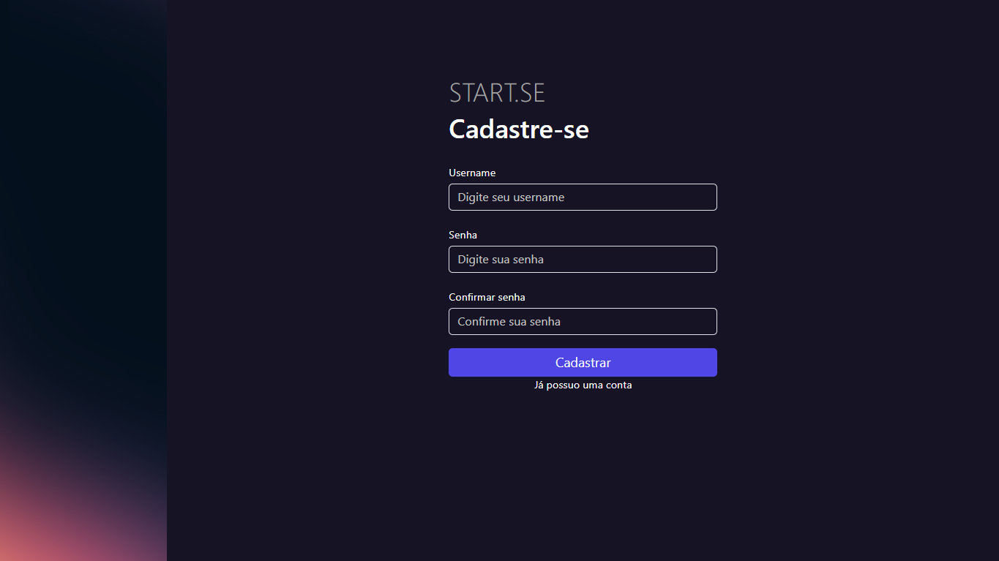
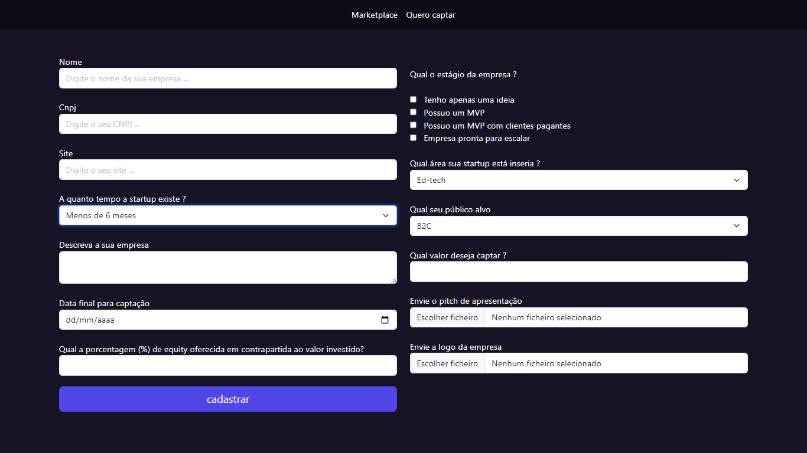
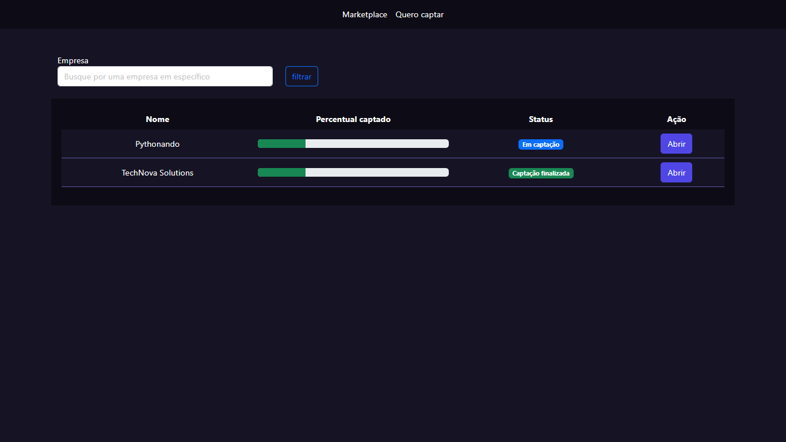
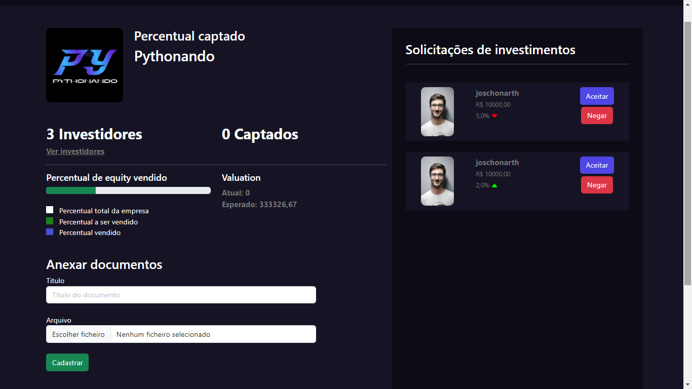
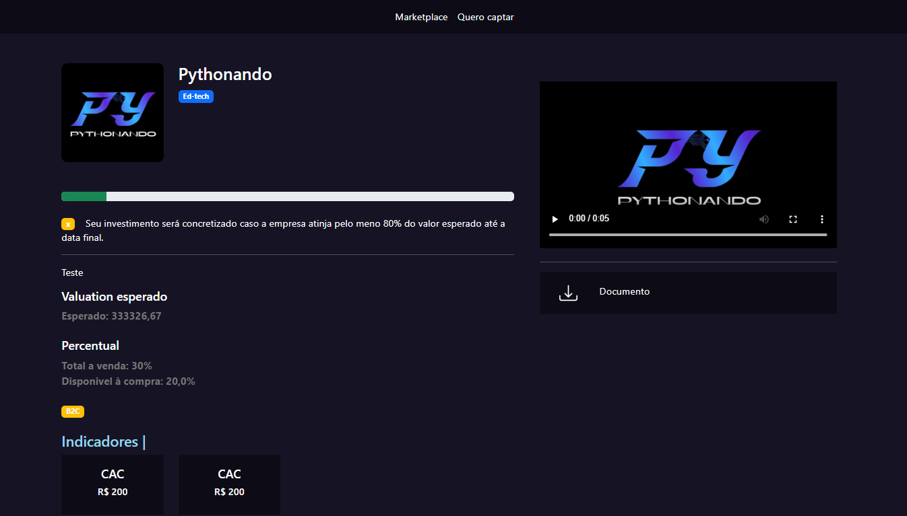

# 🚀 START.SE

Este repositório contém o projeto START.SE, desenvolvido na PYSTACK WEEK 11.0. O sistema foi criado para conectar startups a investidores, utilizando Python e Django para garantir uma plataforma eficiente e robusta.

## 📚 Índice

- [Sobre o Projeto](#sobre-o-projeto)
- [Pré-requisitos](#pré-requisitos)
- [Configuração do Ambiente](#configuração-do-ambiente)
- [Instalação e Execução](#instalação-e-execução)

## 🌟 Sobre o Projeto

O objetivo deste projeto foi criar uma plataforma que facilite a conexão entre startups em busca de investidores e investidores interessados em novos empreendimentos. O sistema foi desenvolvido com Python e Django, utilizando boas práticas de desenvolvimento para garantir um código limpo e eficiente.


<p align="center">
  <a href="assets/start-se-login.png"></a>
  <a href="assets/start-se-cadastro.png"></a>
  <a href="assets/start-se-cadastrar-empresa.png"></a>
  <a href="assets/start-se-listar-empresas.png"></a>
  <a href="assets/start-se-empresa.png"></a>
  <a href="assets/start-se-ver-empresa.png"></a>
</p>


<a href="assets/">🔗 Para mais imagens do projeto.</a>


## 🛠️ Tecnologias Utilizadas

* []() **Python**: Linguagem de programação utilizada para desenvolver a lógica do backend do projeto, permitindo uma integração fluida com o Django e garantindo um código limpo e eficiente.

* []() **Django**: Framework web de alto nível que facilita a construção da plataforma. Ele fornece recursos como ORM (Object-Relational Mapping) para interagir com o banco de dados, sistema de autenticação de usuários e uma arquitetura MTV (Model-Template-View) que organiza o código de forma intuitiva.

* []() **SQLite**: Banco de dados leve e embutido utilizado durante o desenvolvimento e testes do projeto, permitindo armazenar informações sobre startups e investidores de forma simples e eficaz.


## ⚙️ Pré-requisitos

Antes de começar, você precisará ter o Python e o pip instalados em sua máquina. Você pode baixá-los e instalá-los a partir do [site oficial do Python](https://www.python.org/downloads/).

## 🔧 Configuração do Ambiente

### Criar um Ambiente Virtual

Para criar um ambiente virtual, execute o comando correspondente ao seu sistema operacional:

- **Windows:**
    ```bash
    python -m venv venv
    ```

- **Linux:**
  ```bash
  python3 -m venv venv
  ```

### Ativar o Ambiente Virtual

Após criar o ambiente virtual, ative-o com o comando apropriado para o seu sistema operacional:

- **Windows:**
    ```bash
    venv\Scripts\Activate
    ```

- **Linux:**
  ```bash
  source venv/bin/activate
  ```

Caso você encontre problemas de permissão ao tentar ativar o ambiente no Windows, execute o seguinte comando e tente novamente:

  ```powershell
  Set-ExecutionPolicy -Scope CurrentUser -ExecutionPolicy RemoteSigned
  ```

## 🚀 Instalação e Execução

**1. Instale o Django:**
Com o ambiente virtual ativado, instale o Django usando pip: 
```bash
pip install django
```

**2. Execute as Migrações:**
Para configurar o banco de dados, execute:
```bash
python manage.py migrate
```

**3. Execute o Servidor:**

Navegue até o diretório do projeto e execute o servidor de desenvolvimento do Django para testar o projeto:
```bash
python manage.py runserver
```

**4. Acesse a Aplicação:**

🌐 Abra o navegador e acesse http://127.0.0.1:8000/ para ver a aplicação em funcionamento.


## 📞 Contato 

<div>
    <a href="https://www.linkedin.com/in/joschonarth/" target="_blank"></a>
    <a href="mailto:joschonarth@gmail.com" target="_blank"></a>
</div>